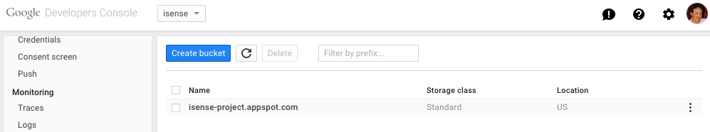

# How to build App Inventor from the MIT sources

* ref: [Google doc: How to build App Inventor from the MIT sources](https://docs.google.com/document/pub?id=1Xc9yt02x3BRoq5m1PJHBr81OOv69rEBy8LVG_84j9jc)
* time: 2018.1.20

**This document contains instructions for how to build App Inventor from the sources and run it on a local machine or upload it to App Engine.**

- [How to build App Inventor from the MIT sources](#how-to-build-app-inventor-from-the-mit-sources)
    - [1. Introduction](#1-introduction)
        - [1.1 Supported platforms](#11-supported-platforms)
        - [1.2 Hosting your service on App Engine, or running it locally](#12-hosting-your-service-on-app-engine-or-running-it-locally)
        - [1.3 Storing your users’ projects](#13-storing-your-users%E2%80%99-projects)
        - [1.3 Login and authentication](#13-login-and-authentication)
        - [1.4 You’ll need to supply a build server](#14-you%E2%80%99ll-need-to-supply-a-build-server)
    - [2. Building App Inventor](#2-building-app-inventor)
        - [2.1 Overview](#21-overview)
        - [2.2 The App Inventor source code](#22-the-app-inventor-source-code)
        - [2.3 Building App Inventor](#23-building-app-inventor)
        - [2.4 Configuration options](#24-configuration-options)
        - [2.5 The App Inventor Companion app](#25-the-app-inventor-companion-app)
        - [2.6 Automated Tests](#26-automated-tests)
    - [3. Running App Inventor on your local machine (MacOS)](#3-running-app-inventor-on-your-local-machine-macos)
        - [3.1 Setting up your MacOSX system: Required software](#31-setting-up-your-macosx-system-required-software)
        - [3.2 Launching App Inventor](#32-launching-app-inventor)
        - [3.3 Launching a build server on your local machine](#33-launching-a-build-server-on-your-local-machine)
    - [4. Building and Launching App Inventor (GNU/Linux)](#4-building-and-launching-app-inventor-gnulinux)
        - [4.1 Setting up your GNU/Linux system: Required software](#41-setting-up-your-gnulinux-system-required-software)
            - [4.1.1 Note on Ubuntu 14.04.1 LTS 64-bit](#411-note-on-ubuntu-14041-lts-64-bit)
        - [4.2 Building App Inventor and Launching it on your local machine (GNU/Linux)](#42-building-app-inventor-and-launching-it-on-your-local-machine-gnulinux)
    - [5. Building and Launching App Inventor (Windows)](#5-building-and-launching-app-inventor-windows)
        - [5.2 Building and Launching App Inventor](#52-building-and-launching-app-inventor)
        - [5.3 Launching a build server on your local machine](#53-launching-a-build-server-on-your-local-machine)
    - [6. Setting up a build server](#6-setting-up-a-build-server)
        - [6.1 Create the buildserver software package](#61-create-the-buildserver-software-package)
        - [6.2 Install the software on the buildserver machine and start the build server.](#62-install-the-software-on-the-buildserver-machine-and-start-the-build-server)
    - [7. Deploying App Inventor on Google App Engine](#7-deploying-app-inventor-on-google-app-engine)
        - [7.1 Issues to consider before deploying on App Engine](#71-issues-to-consider-before-deploying-on-app-engine)
            - [7.1.1 Java and App Engine versions](#711-java-and-app-engine-versions)
            - [7.1.2 App Engine hosting; getting an Application ID](#712-app-engine-hosting-getting-an-application-id)
            - [7.1.3 User login and authentication](#713-user-login-and-authentication)
            - [7.1.4 Storage for user projects](#714-storage-for-user-projects)
            - [7.1.5 Build server](#715-build-server)
            - [7.1.6 App Engine charges for use](#716-app-engine-charges-for-use)
        - [7.2 Building and deploying App Inventor and the Build Server](#72-building-and-deploying-app-inventor-and-the-build-server)
            - [7.2.1  Build App Inventor and deploy it on appspot.com](#721-build-app-inventor-and-deploy-it-on-appspotcom)
            - [7.2.2 Deploy your service to appspot.com](#722-deploy-your-service-to-appspotcom)
            - [7.2.3 Configuring your instance as a Cloud Integration Project](#723-configuring-your-instance-as-a-cloud-integration-project)
            - [7.2.4 Set up a build server and configure your App Inventor service to use it](#724-set-up-a-build-server-and-configure-your-app-inventor-service-to-use-it)
    - [8. Configuration options for the App Inventor service](#8-configuration-options-for-the-app-inventor-service)
        - [8.1  Setting up a white list](#81-setting-up-a-white-list)
        - [8.2 Message of the day](#82-message-of-the-day)
            - [8.2.1 Enabling the message of the day](#821-enabling-the-message-of-the-day)
            - [8.2.2 Setting the text for the message of the day](#822-setting-the-text-for-the-message-of-the-day)
        - [8.3 Terms of Service](#83-terms-of-service)
    - [9. Configuration options for the Build server](#9-configuration-options-for-the-build-server)
        - [9.1 Version number matching](#91-version-number-matching)
        - [9.2 Checking the Build Server Status Information](#92-checking-the-build-server-status-information)
        - [9.3 Changing the Build Server Port Number](#93-changing-the-build-server-port-number)
        - [9.4 Specifying the maximum number of simultaneous builds](#94-specifying-the-maximum-number-of-simultaneous-builds)
        - [9.5 Restricting the allowable App Engine hosts](#95-restricting-the-allowable-app-engine-hosts)
        - [9.6 Path for the Build Server log](#96-path-for-the-build-server-log)
    - [10. Running App Inventor locally with an external build server](#10-running-app-inventor-locally-with-an-external-build-server)
    - [11. Some tips and tricks for speeding up development](#11-some-tips-and-tricks-for-speeding-up-development)

-------------------

## 1. Introduction

App Inventor for Android lets people create apps for android phones by piecing together programming blocks in a web browser. This document is a guide to building and deploying your own App Inventor service using the source code from MIT. It assumes that you’ve already had some experience using App Inventor to build apps, e.g., with the MIT App Inventor service. Now that you’ve used App Inventor, you might want to build your own service for personal use, or to share with a few friends, or as a prelude to working on App Inventor system development.

This document focuses on App Inventor 2, but will highlight any differences with App Inventor classic when needed. [*** App Inventor classic was withdrawn in 2015. obsolete. It probably will not longer build. ***]

if you are familiar with git and github, you can see the [Contributing to App Inventor 2](http://josmas.github.io/contributingToAppInventor2/#/) slide deck for a quick up and running guide.

### 1.1 Supported platforms

Building and deploying an App Inventor server can be done using MacOSX, GNU/Linux, and Windows operating systems, and we have done this extensively at MIT. If you experience any problems, please contact the [Open Source Group](https://groups.google.com/forum/#!forum/app-inventor-open-source-dev).

### 1.2 Hosting your service on App Engine, or running it locally

App Inventor is a Java service built on [Google App Engine](http://code.google.com/appengine/). As with any App Engine service, you can deploy your App Inventor service to Google’s App Engine infrastructure at appspot.com, so that anyone on the Web can access it, provided you give them permission. If you are planning to do that, we suggest that you get some experience with App Engine and with Java App Engine services in Java. Google provides tutorials that show you how to install App Engine for Java and create simple services.

You can also run the App Inventor service on your local machine using the App Engine “dev server” for personal testing and debugging, even if you are not connected to a network. It is also possible to make your dev server available to small numbers of users on your local network, but the developer server is not designed to handle large loads, and we do not recommend using it to provide reliable App Inventor service to more than a handful of users. (Some people have had good experiences running an App Inventor service on the dev server with up to 40 users, although that is with a powerful server machine, not a laptop.)

### 1.3 Storing your users’ projects

Your App Inventor service will maintain storage for individual user projects, both source code and compiled apps (APK files). This storage will be hosted on Google App Engine if you deploy your App Inventor service there, or held on your local machine if you use the dev server. In either case bear in mind that this storage is part of your service: If your service goes away, or you clear the database, the stored user projects will go away. It’s a good idea to ***advise your users to download backup copies*** of their projects to their individual machines in case you need to rebuild your service.

In particular if you upgrade the version of the developer tools (App Engine SDK) projects in the local dev server may get deleted because how they are stored varies between some versions of the App Engine SDK. Projects store in an App Engine service are more robust and in general will not disappear unless there is a bug in App Inventor that damages them (which can happen!).

### 1.3 Login and authentication

Your users will need to login to your App Inventor service and provide a user name or other identifier. There are currently only two options for login:

1. If you host the service on appspot.com, then users should log in with their Google accounts.
2. If you host the service on a local server, then users can log in with any name at all, **and *there is no authentication (no passwords)***. As a consequence, users can read and write each other’s projects, provided they know the login name. So this option will be currently useful only for your individual testing or with a small number of people who work together closely.

### 1.4 You’ll need to supply a build server

The App Inventor service uses an auxiliary `Build Server` that handles the computationally intensive work of compiling and packaging apps. If you’re running App Inventor on your local machine, that machine can act as its own build server. If you deploy your App Inventor service on at appspot.com, you’ll need to obtain and configure a machine to run as the build server. The build server machine must be a machine that is accessible to the machine that hosts your App Inventor service. In particular, for a service running on appspot.com, the build server must be on the public Internet so that it can be accessed by AppEngine. It’s also possible to designate a separate build server machine for a local (not on appspot.com) App Inventor service.

Oracle Java 6 7 is, at this time, the only option to run the Build Server. This is due to the fact that the resultant package for the application has to be signed through the ‘jarsigner’ utility, only available with the Oracle SDK. At this time it is not possible to run the Build Server with other JDKs such as OpenJDK, even though it’s the default installation for Ubuntu Linux. If you are running Ubuntu, make sure you either uninstall Open JDK, or properly install Oracle’s JDK and update all paths. Note that you need a full JDK to run App Inventor, the JRE on its own will not work. We hope that will change in the near future.

## 2. Building App Inventor

This section describes how to build and run the App Inventor service. Once you’ve built the App Inventor service, you can run it on a local server or deploy it to appspot.com. You’ll also need to provide a build server, either by using your App Inventor machine itself as the build server or by providing a separate machine .

### 2.1 Overview

The App Inventor sources are kept on Github in the repository mit-cml/appinventor-sources. You should work from there, and use git in building the system. For an overview of the building operation, see

https://github.com/mit-cml/appinventor-sources/blob/master/README.md

That overview is a good place to start, and it refers to more detailed instructions, including the present document.

### 2.2 The App Inventor source code

> Note: If you intend to work with the sources and contribute back to the project, instead of **cloning** the project as explained in this section, you should **fork** it instead. More information on how to do that in the document: [Developing App Inventor with git and github](https://docs.google.com/document/d/1sAw0QObTxTWqRX7GQRCa2z9TIV2r5AKT9UKMFF1acZI/pub).

The App Inventor source code is available as Free and Open Source Software that you can download. Once you’ve installed the other software listed in section 3, you can clone a git repository of the source code by running the following git command from a shell:

~~~
git clone https://github.com/mit-cml/appinventor-sources.git
~~~

This will create a folder named “appinventor-sources” where the sources (and a copy of the repository) will reside. If you have problems with this command, please visit the MIT Center for Mobile Learning github site at https://github.com/mit-cml.

We’ll refer to this folder throughout the rest of these instructions as ***the appinventor parent folder***. The appinventor parent folder also contains a file called `sample-.gitignore`. This file should be copied to another file simply named `.gitignore` which will keep generated files from being added to the git index (note that the file will be hidden in the finder and terminal after renaming. You can view it passing the flag `-a` to the `ls` command: `ls -al`).

Checking out Blockly as a dependency is also needed, and can be done by issuing the following command (from the appinventor-sources folder):

~~~
git submodule update --init
~~~

If you intend to make changes to the MIT CML’s Blockly fork, please follow instructions in the [Readme file](https://github.com/mit-cml/appinventor-sources#checkout-dependencies)

### 2.3 Building App Inventor

As of September 10, 2013 all future development of MIT App Inventor is oriented to App Inventor 2. To that end, the master branch is now the code for **App Inventor 2**. For a quick guide on the development workflow that the team at MIT follows please look at the [Contributing through github](http://josmas.github.io/contributingToAppInventor2/#/) slide deck. If you intend to do work on App Inventor 1, the branch ai1 in github is what you are looking for.

With everything set up as above, connect to the `appinventor-sources` parent folder. It contains a subfolder called `appinventor`, and we’ll refer to this folder as ***the appinventor folder***

Now you can run the command:

~~~
$ ant clean
~~~

**Cleaning isn’t necessary every time you build**, but it’s a good idea to `clean` each time before you build in case some junk has crept into the various build directories. Note again that if you clean, all your projects will go away, so make sure you have copies of the projects before cleaning. Also note that if you clean, the compilation process will take longer (ant builds incremental changes only, but clean deletes all the available packaged projects).

The App Inventor system requires a secret key called the “authkey.” If you change this key, all users will find themselves logged out when you update your service. To make this key persistant, it is store in a directory name “.appinventor” placed in your home directory on your computer, not in the App Inventor sources. If you have never built App Inventor before, you need to create this key. In general you only need to do this once, even if you delete the App Inventor sources and re-download them.

To build this key, do:

~~~
$ ant MakeAuthKey
~~~

If you forget this step, you will get an error in the next step. If you do, just do the “MakeAuthKey” step and re-do the step below and all should work.

After you’ve cleaned, you can build App Inventor by running the command

~~~
$ ant
~~~

Building should take several minutes and end with the message BUILD SUCCESSFUL.  If something goes wrong, it’s most likely a problem with ant or Java or the App Inventor source.

### 2.4 Configuration options

If you’re building App Inventor to deploy on your local machine for testing or for personal use, you’re ready to run the system.  If you’re deploying to appspot.com, you’ll need to set up a build server and also specify some configuration options, both for the build server and for the App Inventor service itself.   We’ll describe those options below, but if this is your first time building App Inventor, you should just go ahead now and try it for yourself on your local machine.

### 2.5 The App Inventor Companion app

The App Inventor Companion app is used to build apps incrementally. The Companion contains all the components available in the system, so ***whenever a component changes, the Companion has to be changed too***. When you built the system (above) the Companion app should have been built and left in ./build/buildserver/MIT\ AI2\ Companion.apk.

To install the Companion, make sure the “adb” command is in your execution path (so if you type “adb” you get a usage message instead of a “command not found” error).  With your device connected via USB you can issue the command:

~~~
$ ant installplay
~~~

This will uninstall any previous version of the AI2 Companion on your phone and install the new version.

Note that two different Companions exist for App Inventor 2 and App Inventor 1.  The instructions here build the Companion for App Inventor 2.

You can also build the Companion manually (for distribution, for instance). To do so, you can use the target:

~~~
$ ant PlayApp
~~~

From the appinventor folder, the companion gets generated at:  
`./build/buildserver/MIT AI2 Companion.apk`

For a video on how to build the companion manually, you can read this [blog post](http://josmasflores.blogspot.com/2013/06/open-source-development-with-app_15.html). (Note: This blog post was made before we included building the Companion with the “installplay” build target).

Note: The first time you build a Companion the system will create a “debug” android keystore in the .appinventor subdirectory of your home directory. This keystore will then be used to digitally sign the Companion (part of the Android package building process). This means that you can update your copy of the Companion without having to manually uninstall a previous version, provided the previous version was also built by you.

If you have a Companion installed from Google Play or directly from the production App Inventor service, you will have to manually uninstall that version, as it is signed by our production keys. Similarly when you are finished developing and wish to re-install the Companion from the Store, you will have to manually uninstall your own version first.

### 2.6 Automated Tests

The App Inventor sources contain a number of automated tests at different levels or automation (from unit to functional). Tests for Java code have been written using the [JUnit](http://junit.org/) framework, and no additional libraries are needed to run them (JUnit is contained in the appinventor/lib folder). Test for the JavaScript code rely on PhantomJS, and this tool needs to be available in your PATH. More information about these tests can be found in this [README](https://github.com/mit-cml/appinventor-sources/tree/master/appinventor/blocklyeditor/tests) file.

The JavaScript tests are wired into the overall ant script, and will run with the Java tests. To run them alls you can run the command:

~~~
$ ant tests
~~~

It is important to run all tests before and after changing any code, but if you only intend to use the sources (and not modify them), running tests is a good way to make sure that things are still working.

## 3. Running App Inventor on your local machine (MacOS)

This section shows how to run App Inventor on your local machine for development and testing.   
Before you try to use App Inventor, you’ll need to have installed the App Inventor setup software, just as with using MIT App Inventor.   The setup software is the same for users and developers:  If you’ve already been using MIT App Inventor 1 on your computer, you needn’t do anything extra to use your local version. Note that packages for App Inventor 2 are still a work in progress. A version for Mac is available through the [setup pages](http://appinventor.mit.edu/explore/ai2/setup.html). This [document](https://docs.google.com/document/d/1M7Qnws2Y0mAZufIgQKI6RO_UhUbWLIyiWVlkRdJEUiU/pub) describes how to access and use the latest version of the setup tools for App Inventor 2.

### 3.1 Setting up your MacOSX system: Required software

Before starting to work with App Inventor, you’ll need following software:

* Java:  You need Java 7.  App Inventor doesn’t yet build with Java 8. You can check your version by typing “java -version” at a shell.   WARNING.  Just to keep things confusing,  Java 7 is also called Java 1.7, followed by a minor version number.   As of today (Jan. 2, 2015) you should use version 1.7.0_72, 
    * Version 1.7.0_71 will fail to run the unit tests.   Version 1.7.0_55 and 1.7.0_45 will both work.  You can find 1.7.0_72 here:  
    * http://www.oracle.com/technetwork/java/javase/downloads/jdk7-downloads-1880260.html
* Apache ant: 1.8. 1 or 1.8.2.   Type “ant -version” at a shell to check your version.   If you are not running the right version, you may have to get it from the web
* bash: You should be running bash as your shell.
* PhantomJS.  You’ll need to install this in order to run the unit tests: http://phantomjs.org/
In addition, you’ll need
* Git: We suggest that you manage your source code using the git distributed revision control system. Most Linux distributions come with Git you can also download and build it from http://git-scm.com.   
* Google AppEngine Java SDK.  Get and install the Java version of the SDK from https://developers.google.com/appengine/downloads.   Make a note of the folder where you install it.   We’ll refer to this folder as the appengine SDK folder in the instructions below. (If you are planning to do some development using Eclipse and the Android plugin, you can install the SDK directly from the plugin).
* Python is also a dependency, but it’s a default in most OSX installations.

### 3.2 Launching App Inventor

You can launch your local App Inventor service by connecting to the appinventor folder and running the command (on a single line)

Note: The reference to 1.9.36 below is just an example. The version of the sdk changes frequently. So replace the 1.9.36 below with the version number that you downloaded above.

~~~
<your appengine SDK folder>/appengine-java-sdk-1.9.36/bin/dev_appserver.sh --port=8888 --address=0.0.0.0 <your-appinventor-folder>appengine/build/war/
~~~

Where `<your appengine SDK folder>` is the path to where you installed the App Engine SDK, and you replace “1.9.36” with the number of the Appengine SDK version you are running.

> **Note**:  It’s a good idea to periodically download the latest version of the SDK. You might also want to create a link called appengine-java-sdk, linked to the latest version, and use that link in your launch command so you don’t have to change your command when you update the SDK version.
>
> **Note**: Make sure the dev_appserver.sh file is executable.)

You can change the port number and the locations of the AppEngine SDK and App Inventor directory to suit your system configuration.   The --address flag is an AppEngine feature that lets other computers connect to your server over the Web.

The shell window will print status information as the server runs.    You’ll probably want to maintain this as a log for troubleshooting.   For convenience, you may want set the server up to run detached, and save its output to a log, with a command line (all on one line) like:

~~~
nohup <your-appengine-SDK-folder>/appengine-java-sdk-1.9.36/bin/dev_appserver.sh --port=8888 --address=0.0.0.0 <your-appinventor-folder>/appengine/build/war/ > serverlog.out &
~~~

You’ll find it useful to create a shell script that runs this command, to save yourself the bother of typing it over and over.

Run this command and wait about 30 seconds while the system starts up.  (You can follow the progress in the log.)   Then browse to localhost:8888 and you should see App Inventor running.  People on your local network should also be able to use it by browsing to `<your IP address>:8888`.

Test the system by creating some projects.   This should be an almost completely working App Inventor system..   You should be able to open the Blocks editor, connect the phone or the emulator, download and upload files -- in short, everything except packaging apps.   You’ll need a buildserver to package apps.

### 3.3 Launching a build server on your local machine

You’ll need to set up a build server.  You can use your local machine as the build server.   You can also designate a different machine as a buildserver,  as described below in in *Setting up a Build Server*.     To start and run the build server on your local machine, open a new shell, connect to the buildserver subdirectory of the App Inventor directory

~~~
cd your appinventor directory
cd buildserver
~~~

and run

~~~
ant RunLocalBuildServer
~~~

If all is successful, you should see output that ends in

~~~
[java] Server running
~~~
	
As with the App Inventor server, you’ll probably want to maintain a log, and also run detached, with a command line like:

~~~
cd ~/appinventor-build/appinventor/buildserver
nohup ant RunLocalBuildServer > ../../buildserver-log.out &
~~~

When you build a project, it’s useful to watch the buildserver output to see the steps it goes through in packaging and to verify that things are running.  Packaging can take a long time, especially if you are using a small machine for the build server.

You might want to create a shell script that runs this command together with the command above that launches App Inventor, so you can launch App Inventor and start the build server with a single command for testing and debugging.

You can verify that your build server is running by looking at the log, or by viewing some status information with a web browser.    Browsing to

`localhost:9990/buildserver/vars`

will show you some status information about the server and the machine it’s running on.  Also, browsing to

`localhost:9990/buildserver/health`

should respond OK if the server is running.

## 4. Building and Launching App Inventor (GNU/Linux)

This section describes how to build and run the App Inventor service on machines running the GNU/Linux operating system.   Once you’ve built App Inventor,  you can run it on your machine’s dev server for testing and development or you can deploy it to appspot.com.   You’ll also need to create a build server.  The steps here are almost identical to those for MacOS.  
Before you try to use App Inventor, you’ll need to have installed the App Inventor setup software, just as with using MIT App Inventor.   The setup software is the same for users and developers:  If you’ve already been using MIT App Inventor 1 on your computer, you needn’t do anything extra to use your local version. Note that packages for App Inventor 2 are still a work in progress. A version for Mac is available through the [setup pages](http://appinventor.mit.edu/explore/ai2/setup.html). This [document](https://docs.google.com/document/d/1M7Qnws2Y0mAZufIgQKI6RO_UhUbWLIyiWVlkRdJEUiU/pub) describes how to access and use the latest version of the setup tools for App Inventor 2.

### 4.1 Setting up your GNU/Linux system: Required software

Before starting with App Inventor, make sure your server includes the following software:

* Java:  We have tested build using Oracle Java  7.   Other versions might work, but we haven’t tested these.   We recommend using Oracle Java as opposed to OpenJDK.  Feel free to experiment with OpenJDK for building App Inventor, but there may be incompatibilities.  In particular, when you are using App Inventor 1 to create apps, the Blocks Editor might not work under OpenJDK due to the fact that the needed utility to sign jar files “jarsigner” is not provided with OpenJDK.  Once you’ve installed Java, check that Java and Java Web Start both work by trying the standard App Inventor “test your Java configuration” tests at http://beta.appinventor.mit.edu/learn/setup/index.html.   If this doesn’t work, you might need to reinstall Java. In App Inventor 2, the blocks editor does not use Java anymore (it’s a JavaScript app running in the browser), so less Java problems are expected.

* Apache ant:  You may need to install Apache ant, or you may need to update your installed version to 1.8.1 or 1.8.2 (or newer).  Check your version.
    * bash: You should be running bash `apache-ant-1.8.2 (or newer)`
* `export JAVA_HOME=/usr/local/build` as your shell.   To make ant work more conveniently, under GNU/Linux, add the following to your .bashrc file, making the necessary changes to reflect the actual directories where you’ve installed Java and ant:
  ~~~
  export ANT_HOME=/usr/share/ant/adtools/java/jdk
  export PATH=${PATH}:${ANT_HOME}/bin
  ~~~

* git: We suggest that you manage your source code using the git distributed version control system. You can find an appropriate distribution at http://git-scm.com. Many Linux distributions also come with git as part of the distribution.
* Google AppEngine Java SDK.  ***NOTE: there seems to be an issue with version 1.9.28, so download 1.9.27 for now***. Get and install the latest Java version of the SDK from developers.google.com/appengine/downloads.html.
* 64bit compatibility: If you are using a 64bit machine and JDK, you will need to install 32Bit compatibility for aapt to work. In Ubuntu you can do so with the command: `sudo apt-get install ia32-libs`
* Python is also a dependency, but it’s a default in most Linux installations.

#### 4.1.1 Note on Ubuntu 14.04.1 LTS 64-bit

As of Ubuntu 14.X the compatibility package is32-libs does not exist anymore. The following packages have been tested as a good combination to get App Inventor up and running in this distribution:

* openjdk-7-jdk
* ant
* lib32z1
* lib32ncurses5 
* lib32bz2-1.0
* lib32stdc++6

Oracle JDK 7 should also be an option if that’s your preference.

### 4.2 Building App Inventor and Launching it on your local machine (GNU/Linux)

Once you have the required software installed, the steps for getting the source code, building App Inventor, and launching it on your local machine for testing and development are the same as for MacOS described above.

## 5. Building and Launching App Inventor (Windows)

This section describes how to build and run the App Inventor service on machines running the Windows operating system.   Once you’ve built App Inventor,  you can run it on your machine’s dev server for testing and development or you can deploy it to appspot.com.   You’ll also need to create a build server.  The steps here are almost identical to those for MacOS and GNU/Linux, but the scripts for launching AppEngine are *.cmd files instead of *.sh files.

5.1 Setting up your Windows system: Required software

* You will need Java version 7.
* Ant ( http://ant.apache.org/bindownload.cgi )
    * You might need to add Ant to Windows System/User Variables
    * (For Windows 7, My Computer --> Properties --> Advanced System Settings --> Environment Variables --> System/User Variable)

* GitHub (https://github.com/)
    * a. You might need to add git to the Windows System Variables
    * b. After installed the Github, you can clone the App Inventor source code from here.

* AppEngine SDK ( https://developers.google.com/appengine/downloads ) ***NOTE: there seems to be an issue with version 1.9.28, so download 1.9.27 for now.***
    * a. The current supported version for MIT App Inventor is 1.9.27.

* Android SDK ( http://developer.android.com/sdk/index.html )
    * a. Recommend to use the installer version
* Python (http://www.python.org/ftp/python/2.7.5/python-2.7.5.msi) 
    * you will need to install Python and add it in your PATH (environment variables). We recommend using version 2.7.5, but any newer version should work.
* PhantomJS

### 5.2 Building and Launching App Inventor

When running from the Command Prompt, one might need to make sure there is no space between any letters in the directory. If there is, you need to change the directory, or get a new account name without a single space (Windows 7 doesn’t support changing the user account name). *see note below*

Please note that the default directory will be C:\Program File\xxx, and the there is a space between the word Program and File. The recommended installation path will be a direct sub-folder in the C:\. If you follow this path, and you have an existing Java JRE or JDK installed, you need to uninstall them and then do the installation, or add the new variable path to the “Path” variable under the System Variables.

**NOTE**:  Rather than running from the Command Prompt, if you run commands from msysgit using git bash (https://msysgit.github.io/), the process for installing will be identical to Mac OS.  There is no need to change directory names to avoid spaces or change the source code.  In addition, you will be able to run the *.sh files instead of *.cmd.  With all appropriate software installed as listed above, the process is identical to Mac OSX installation.  This has been tested and verified with git bash from msysgit.

Finally, you need to check whether all the required variables are set properly by entering “set” into the command prompt. If they are not, you might need to double check that you make the change using the admin account, or reboot the OS (in some rare cases).

Build

You might want to double check JAVA_HOME variable by entering the command `echo %JAVA_HOME%` to the command prompt.  Not having this set correctly will result in many compilation errors when you try to build App Inventor..

If you do see some errors, or failures during the building process, go back to double check the source code and do `ant clean` before you do the next `ant`.

Users have reported several problems when compiling the system. They are generally associated with how Windows allocates memory for the Java heap. Environment variables can help with this process; some users have reported that creating the following variable makes the errors go away:    
`set _JAVA_OPTIONS=-Xmx1024M`

In other cases, Ant options seem to work too:  
`set ANT_OPTS=-Xms512m -Xmx512m`

Launching

When running the App Engine, you should call the `.cmd` file, NOT the `.sh` file as is the case for OSX and Linux. 

You can launch your local App Inventor service by connecting to the appinventor folder and running the command (on a single line)

~~~
<your appengine SDK folder>/appengine-java-sdk-1.9.11/bin/dev_appserver.cmd --port=8888 --address=0.0.0.0 appengine/build/war/
~~~

**NOTE: As of 4/18/2016 you must use a version of the App Engine SDK that is at 1.9.27 or lower. The dev_appserver in newer versions will not work. You will also want to have the latest version and use that for deployment to App Engine itself.**

Where `<your appengine SDK folder>` is the path to where you installed the App Engine SDK, and you replace “1.9.11” with the number of the Appengine SDK version you are running.  (It’s a good idea to periodically download the latest version of the SDK. Also make sure the dev_appserver.cmd file is executable.)

You can change the port number and the locations of the AppEngine SDK and App Inventor directory to suit your system configuration.   The `--address` flag is an AppEngine feature that lets other computers connect to your server over the Web.

The shell window will print status information as the server runs.    You’ll probably want to maintain this as a log for troubleshooting.   For convenience, you may want set the server up to run detached, and save its output to a log, with a command line (all on one line) like:

Run this command and wait about 30 seconds while the system starts up.  (You can follow the progress in the log.)   Then browse to localhost:8888 and you should see App Inventor running.  People on your local network should also be able to use it by browsing to <your IP address>:8888.

Test the system by creating some projects.   This should be an almost completely working App Inventor system..   You should be able to open the Blocks editor, connect the phone or the emulator, download and upload files -- in short, everything except packaging apps.   You’ll need a buildserver to package apps.

### 5.3 Launching a build server on your local machine

You’ll need to set up a build server.  You can use your local machine as the build server.   You can also designate a different machine as a buildserver,  as described below in in Setting up a Build Server.     To start and run the build server on your local machine, open a new shell, connect to the buildserver subdirectory of the App Inventor directory

~~~
cd your appinventor directory
cd buildserver
~~~

and run

~~~
ant RunLocalBuildServer
~~~

If all is successful, you should see output that ends in

~~~
[java] Server running
~~~

When you build a project, it’s useful to watch the buildserver output to see the steps it goes through in packaging and to verify that things are running.  Packaging can take a long time, especially if you are using a small machine for the build server.

You might want to create a shell script that runs this command together with the command above that launches App Inventor, so you can launch App Inventor and start the build server with a single command for testing and debugging.

You can verify that your build server is running by looking at the log, or by viewing some status information with a web browser.    Browsing to  
`localhost:9990/buildserver/vars`

will show you some status information about the server and the machine it’s running on.  Also, browsing to  
`localhost:9990/buildserver/health`

should respond OK if the server is running.

## 6. Setting up a build server

The instructions above showed how to deploy App Inventor on a local machine, which functions both as the App Inventor service and the build server.   If you are deploying the App Inventor service on Google App Engine at appspot.com., you’ll need to provide your own build server.   This section describes how to set up a build server.   The following section will show how to use this build server in conjunction with appspot.com to deploy a service that can be used by anyone on the Web (and you can also set up access restrictions).

The instructions here are for build server machines must be running the Linux or MacOS.  Setting up build servers for Windows are described at the end of this document.   The build server machine must be on the public internet so it is reachable from appspot.com.  For example, you can’t set it up so that it runs behind a firewall.

The steps in creating a buildserver are

1. Create the software for the buildserver machine
2. Install the software on the buildserver machine and start the server, as described in this section.

Section 6 will explain how to launch your service on App Engine and configure it to use your build server.  Section 7 will discuss some configuration options you can specify for build server and for the App Inventor service itself.

### 6.1 Create the buildserver software package

To create the buildserver software, first build app inventor as explained above in section 2.   But don’t go on the launch the service as in section 3.    Instead, open a new shell, connect to the buildserver subdirectory of the App Inventor folder

~~~
cd your appinventor directory
cd buildserver
~~~

and run

~~~
ant BuildDeploymentTar
~~~

This should generate, in the appinventor folder, a file:  
`build/buildserver/BuildServer.tar`

Create a new folder on your desktop called `for-BuildServer` and copy `BuildServer.tar` to that new folder.

Look in the App Inventor folder for a subdirectory called `misc`.  In it, there should be a file called `launch-buildserver`.   Copy `launch-buildserver` to the `for-Buildserver` folder.
The `for-buildserver` folder now contains the software package to be installed on the buildserver machine.   

### 6.2 Install the software on the buildserver machine and start the build server.

The buildserver machine must be reachable from the public internet.
Log on to that machine and pick a directory to hold the buildserver software.     We’ll refer to this folder as the ***buildserver folder***.  Place `Buildserver.tar` and `launch-buildserver` in the buildserver folder.

Connect to the buildserver folder, and run the command

~~~
tar -xf BuildServer.tar
~~~

This should produce a folder called `lib`.

Finally,  in the buildserver folder, run

~~~
./launch-buildserver
~~~

See below for some of the options you might want to specify for launch-buildserver

Running launch-buildserver will start the build server and create a log file `buildserver-log.out`.   If you view the this log,  you should see startup messages, ending in “server running”.   Later, as you package apps with your App Inventor service, you can examine this log file to watch the build progress and to help diagnose build errors.   

> Note: launch-buildserver attempts to save the buildserver log file in the directory /home/buildserver.  This will fail if there is no such directory on the buildserver machine.
You can change this target directory with one of the buildserver options (see below).

To check that the buildserver is running, use a browser to visit the URL  
`http://<your buildserver machine>:9990/buildserver/vars`

Where `<your buildserver machine>` is the hostname (or IP address) of the buildserver machine.   If the build server is running, you should see a page with status information.  If you don’t see this, check the buildserver log for clues as to what might be wrong.

## 7. Deploying App Inventor on Google App Engine

Once you’ve gotten experience running the App Inventor service on your local machine, you can deploy your own service Google AppEngine at appspot.com and make it available to anyone on the web.   This section describes how to deploy the service on Google App Engine from machines running the MacOS or GNU/Linux operating system.  Instructions are the same for both systems.  Deploying on Windows is discussed at the end of this document.

The instructions here assume that, as described above in sections 2 and 3, you’ve already built and launched App Inventor on your local system, and that you know how to set up a build server,

### 7.1 Issues to consider before deploying on App Engine

Here are some things to keep in mind about deploying on App Engine.  These considerations are especially important if you are going to provide the system as a service for others to use, rather than just for personal experimentation.

#### 7.1.1 Java and App Engine versions

Currently (May 2017) We recommend the following versions of Java and Google App Engine.  This pair was tested by Hal in May 2016:
* Java version 1.7.0_79.   Other versions might also work.   Java 8 works for building a standalone system, but deploying to App Engine requires Java 7.   If you use Java 8 specific features the code may fail in production.
* Appengine-java-sdk-1.9.36. (As of May 2017)
    * Versions below v1.9.36 do not work for building a local instance because they use the deprecated Cloud files API.  

#### 7.1.2 App Engine hosting; getting an Application ID

If you’re not using a local server, then you will run App Inventor as a Java web service on [Google App Engine](http://code.google.com/appengine/).   As with any App Engine service, you deploy App Inventor as a hosted service on Google’s infrastructure at appspot.com.

The instructions below are self-contained.  But if you are going to be hosting a service for others, we strongly recommend that you get some experience with App Engine and Java App Engine services.  There are several tutorials on the Google App Engine site that describe how to [get started](https://developers.google.com/appengine/docs/java/gettingstarted/).

You’ll need to create an application on Google App Engine to run your App Inventor service, and register an *application id* for it.   You can learn how to do this from the App Engine [tutorials](https://developers.google.com/appengine/docs/java/gettingstarted/uploading).

You’ll also need to configure your application to use Google Cloud Store (GCS).   Part of this configuration will involve creating a  *GCS bucket*; this will happen when you [configure your instance as a cloud integration project](#723-configuring-your-instance-as-a-cloud-integration-project).  Google requires you to start a free trial with Google App Engine before you’re allowed to create a GCS bucket.  The free trial lasts for a limited time and provides a limited amount of storage, but this should be sufficient for testing.   Google will ask you to enter a credit card number before activating the trial, even if your expected charge will be zero.

#### 7.1.3 User login and authentication

The local App Inventor service you created above had no user authentication.   In contrast, the service on App Engine requires people to log in with a Google ID.   In principle, anyone on the web with a Google ID can use your service, which is probably not what you want.   To restrict access, App Inventor lets you optionally configure a whitelist , where the only people who can use the service are those whose IDs you include on the whitelist.   You can set up the whitelist when you set the configuration options.

#### 7.1.4 Storage for user projects

The App Inventor service will maintain storage for individual user projects, both source code and compiled apps (APK files), of Google App Engine data bases.   Remember that this user project storage is part of your service:  If you clear the database, then the stored user projects will go away.   If you are experimenting with the service, and also providing it for others, you should advise your users to maintain backup copies of their projects in their individual machines in case you need to rebuild the service and clear your database.

#### 7.1.5 Build server

In contrast to a local service, where the local App Inventor service can also be the build server, you must provide a separate build server machine for an App Inventor service hosted on App Engine.  The build server machine must be on a public network where Google App Engine can reach it.

#### 7.1.6 App Engine charges for use

Google charges for App Engine use, beyond a certain amount.   This limit should be adequate for personal use or in providing a service for a few users.   But with more than that, you may find yourself running up against App Engine’s free use limit.  If you are running a service for others to use, you should experiment with small user groups and keep monitoring the load.

### 7.2 Building and deploying App Inventor and the Build Server

Deploying to App Engine has two main parts:

1.	build App Inventor and upload to App Engine
2.	set up a build server and configure your App Inventor service to use it

There are also configuration options for the App Inventor service and the build server that you may want to set.  (See below)

#### 7.2.1  Build App Inventor and deploy it on appspot.com

Build App Inventor just as you did above in section 2.  But don’t go on to run it on your local machine.   

#### 7.2.2 Deploy your service to appspot.com

Connect to the App Inventor directory on your local machine and run the command (all on one line)

~~~
<your-appengine-SDK-folder>/bin/appcfg.sh -A <your-application-id> --oauth2 update appinventor/appengine/build/war
~~~

where `<your-appengine-SDK-folder>` is the path to where you installed the App Engine Java SDK, and `<your-application-id>` is the application id you created with Google App Engine.

> Note:  You may want to create a script with the command line above, to avoid having to retype it in the future.

Now you should be able to browse to `<your-application-id>.appspot.com` and see your App Inventor service running there.    You should be able to use it, open the blocks editor, and work interactively with the phone or emulator -- everything but packaging apps.

#### 7.2.3 Configuring your instance as a Cloud Integration Project

In order to use Cloud Storage, your instance must be configured as a Cloud Integration Project. Info is here: https://cloud.google.com/appengine/docs/java/googlecloudstorageclient/activate

See the section labeled “Using a default bucket”: 

2. If your app doesn't have a default bucket, create one:
    1.	Visit the App Engine Admin console and select your app.
    1.	Select **Application Settings** in the left navigation pane and scroll to the bottom of the page to *Cloud Integration*
    1.	Click **Create** and wait for the bucket to be created. The bucket is completely set up and ready for use.

Notice that these instructions are performed with the [App Engine Admin console](https://appengine.google.com/)—*which is not the same as the Google Developers Console!*

After doing this, you should be able to see the new, default bucket in Google Developers Console \> Storage \> Cloud Storage \> Browser. It looks like this:

Even though the bucket appears immediately after the Cloud Integration task is completed, you will have to wait a little while—perhaps an hour—before your new instance can use its storage.

#### 7.2.4 Set up a build server and configure your App Inventor service to use it

To package apps, you’ll need a build server.   Set up and launch a build server as described above in section 5, and test that the server is running and is reachable from the public internet.
Now connect to the appinventor folder on your local machine find the file  
`appengine/build/war/WEB-INF/appengine-web.xml`

This assumes you’ve already built App Inventor on that machine.  *Warning*: Make sure you edit the file in the folder `appengine/build/war` and not the version of the file in `appengine/war`.

Change the line that reads  
`<property name="build.server.host" value="localhost:9990" />`  
to replace “localhost” with the name for your Build Server machine, specifying port 9990, for example,  
`value=”mybuildmachine.myschool.edu:9990”`.

> Note: Keep the port at 9990. It is possible to change to a different port, but this requires also making some other changes, and changing the port where the buildserver is listening See the section below on *Changing the Build Server Port Number*.

Re-deploy your App Inventor service using the same appcfg.sh command as above, and test that you can package an app.   If something goes wrong, use your browser to check the build server’s /buildserver/vars page to verify that your build server is running and that your App Inventor service can reach it over the network.  It might also help to look at the information shown if you click the *Debugging* link on the App Inventor Designer page.

## 8. Configuration options for the App Inventor service

This section describes some useful options you can configure for your App Inventor service.

### 8.1  Setting up a white list

The App Inventor server can be configured to use a whitelist:  only users on the list will be permitted to log in.  Others will get a message saying that the server is not available.  The whitelist is located in the file  
`<your-appinventor-folder>/appengine/build/war/WEB-INF/whitelist`

Edit this file to list the user addresses you want to permit, one address per line.  Don’t forget to include your own address.

Now turn on the whitelist restriction:  Find the file  
`<your-appinventor-folder>/appengine/build/war/WEB-INF/appengine-web.xml`

Edit the line that reads  
`<property name="use.whitelist" value="false"/>`  
to change “false” to “true”.   

You can leave the whitelist restriction off if you wish.   Bear in mind that if you do so, anyone will be able to connect to your service.

### 8.2 Message of the day

You can configure App Inventor specify a message of the day (MOTD), that users will see at the upper right of the designer.   This feature is turned off by default, and we suggest that you keep it off.

#### 8.2.1 Enabling the message of the day

But if you do want to display a MOTD for your service, find the file  
`<your-appinventor-folder>/appengine/build/war/WEB-INF/appengine-web.xml`

Change the line that reads  
`<property name="motd.check.interval.secs" value="0" />`  
to make the value an interval for checking is there is a new MOTD.  For example, a value of 900 would check every 15 minutes. A value of 0 disables the MOTF.

We suggest that you keep the checking interval long, or keep the MOTD disabled, because the constant checking puts load on the App Engine service, which will increase your instance’s usage statistics and may put you past the free limit of App Engine services.

#### 8.2.2 Setting the text for the message of the day

*Do this step only if you chose to enable the MOTD.*  
Once your App Inventor service is running, you can specify the text for the MOTD by opening the administration console for your service (from appspot.com) and selecting Data Viewer on the left (under data).   Use the “By kind” dropdown list to select MotdData and open up the item with id=1.   Under the Content section, you’ll see a box for Value.   You can edit the contents of that box to create the new MOTD text.    You can make this MOTD change at any time.  You don’t have to restart the service in order for it to take effect.

### 8.3 Terms of Service

People are asked to agree to terms of service the first time they connect to your appinventor service.   The terms of service are an HTML document located at  
`<your-appinventor-folder>/docs/about/termsofservice.html`  
and you can edit these as you wish. This file will be reflected in the static page  
`http://<your-appinventor-server>/about/termsofservice.html`

To configure App Inventor to now ask for people to agree to terms of service at all, you need to turn on the TOS popup window. Go to the appinventor folder and find the file  
`<your-appinventor-folder>/appengine/war/WEB-INF/appengine-web.xml`

Edit the line that reads  
`<property name="require.tos" value="true" />`  
to change “true” to “false”.   

The contents of the TOS popup window can be edited in  
`<your-appinventor-folder>/appengine/war/Ya_tos_form.html`  
Change that popup, which is a small box, to link to `about/termsofservice.html`

## 9. Configuration options for the Build server

This section describes configuration options for the build server.  Generally, these are specified as command-line options to launchbuildserver.

### 9.1 Version number matching

Each App Inventor release has a version number (e.g., “61”).   You’ll find this version shown at the bottom right of the designer screen in the browser, at the bottom left of the blocks editor window, and at the beginning of the Build Server log.  These versions must match, or else App Inventor won’t build projects.    When you update to a new release, be sure to update both the build server and the App Inventor service.   If you are using someone else’s Build Server, you must work with them to both use the same version.

You can configure App Inventor to not enforce version number matching, something that might be useful when you are testing new versions.

To turn off version number matching, go to the appinventor folder and find the file  
`<your-appinventor-folder>/appengine/build/war/WEB-INF/appengine-web.xml`

Edit the line that reads  
`<property name="build.send.git.version" value="true" />`  
to change “true” to “false”.   

### 9.2 Checking the Build Server Status Information

To check whether the Build Server is running, browse to the URL  
`http: <address:port>/buildserver/health`  
where `<address:port>` is the name and port where you deployed the Build Server.  If the server responds “OK”, then it is running and accepting build requests.
If you browse to  
`http: <address:port>/buildserver/vars`  
you’ll see information about the status of the server including memory usage and load average.  There’s also information about the number of jobs built and rejected and the number of simultaneous builds, which might be useful in tuning your server to match the load (see below).

### 9.3 Changing the Build Server Port Number

The build server port is set by default at 9990.   You should leave it set at 9990 if you can, but if you really need to change it, you can do it as follows:

First, as described above under “Specify the Build Server machine”:  Go to the appinventor folder and find the file  
`<your-appinventor-folder>/appengine/build/war/WEB-INF/appengine-web.xml`

Change the line that reads  
`<property name="build.server.host" value="localhost:9990" />`  
to the correct hostname and port.   

Then launch the Build Server to use this port number by running launchbuildserver with the command line option  
`--port n`  
where n is the port number.  You should use your browser to check the build server status and verify that the it is listening on the correct port.

### 9.4 Specifying the maximum number of simultaneous builds

Building projects is a compute-intensive task.   Several users trying to build simultaneously can overwhelm a build server.    Your users will notice this by the fact that projects take a very long time to build.

You can configure the Build Server to limit the number of build tasks it will work on simultaneously.  If the maximum number of simultaneous builds is set to 8, for example, and there are currently 8 builds going on, the an attempt to do an additional build will get a response saying that the server is busy, with a request to try again in a few minutes.  The number of rejected requests is included in the Build Server status information.

You can adjust the max number of simultaneous builds and experiment with what works, given your build server and the number of users who are working with it.    The default is set to allow an unlimited number of simultaneous builds.  You’ll probably want to change this if you are deploying a service for public use.   Something like 8 simultaneous builds is a realistic number for a reasonably powerful machine.

To change this parameter, edit the launch-buildserver script as described above for the port number, adding the option  
`--maxSimultaneousBuilds 8`  
or whatever number you want to use instead of 8.   Setting the number to 0, or leaving out the optional argument,  makes the maximum number of simultaneous builds unlimited.

### 9.5 Restricting the allowable App Engine hosts

Normally you build server will respond to any App Inventor that requests it to build.   You can restrict this to a list of designated hosts with the requiredHosts option to launchbuildserver.   Calling launch builder with the option  
`--requiredHosts list of hosts`  
will cause the build server to respond only to hosts in the list.

### 9.6 Path for the Build Server log

You can change the location where the Build Server will write its log by using the logpath option:  
`--logpath <path to log file>`

## 10. Running App Inventor locally with an external build server

Note: This isn’t implemented yet.   For now, if you run App Inventor on your local machine, you must also use that machine as the build server.

## 11. Some tips and tricks for speeding up development

See the suggestions [in this document](https://docs.google.com/document/d/1sAw0QObTxTWqRX7GQRCa2z9TIV2r5AKT9UKMFF1acZI/edit#heading=h.e5ttjsa1wtlw).