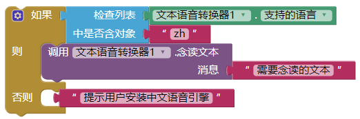
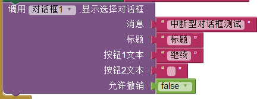
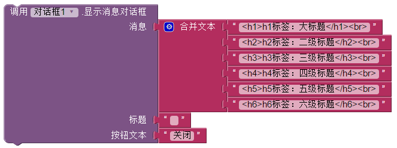
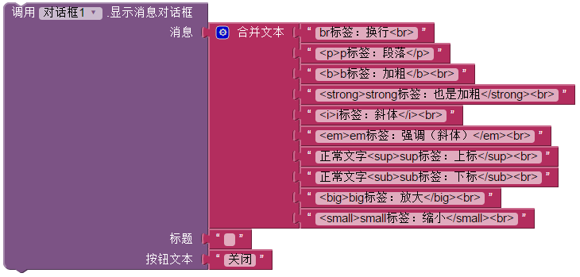

# AI中必须了解的知识点

## 透明色/半透明色设置

在appinventor里，该如何设置透明色或者般透明色呢  
只需要像下图这样创建一个颜色即可  

列表中每个数字的范围都是0~255，且依次代表：
1. 红色通道（红的程度，255最红）  
2. 绿色通道（绿的程度，255最绿）  
3. 蓝色通道（蓝的程度，255最蓝）  
4. Alpha通道（透明度，0完全透明，255相当于没有设置透明度） 

## 颜色系统解析

颜色在Appinventor中是使用RGBA格式来表示的  
传统的RGB格式是这样的：#FF0000 (纯红)， 或者这样： rgb(255, 0, 0)  
而RGBA在三原色基础上加了一个alpha通道：透明度  
于是可以表示为：rgb(255,0,0,0.5) (半透明红色)  
其中相比前面多出来的0.5，就是一半透明度的意思（参见[透明色/半透明色设置](#透明色半透明色设置)）  
## 还原组件默认样式

将颜色设为0即可  
  

可以用这个方法的组件有：

* 按钮
* 日期选择框（本质是按钮）
* 列表选择框（本质是按钮）
* 密码输入框
* 文本输入框（跟密码输入框一个道理）
* 时间选择框（本质是按钮）

## 重启屏幕

有的时候做App难免需要重启屏幕  
比如说，要实现游戏的重新开始功能。  
所以，只需要像下图这样即可做到重启屏幕：  
  
不过，在实际使用中，需要把文本中的`ScreenName`替换成实际的屏幕名字  

**实际上，这个方法也可以用于屏幕切换：开启新屏幕的同时关闭当前屏幕，避免新屏幕关闭后回到原先的屏幕的情况**

## 去除标签外边距

其实，默认情况下标签组件就算是设为0像素的高度或者宽度，组件依旧会占着一定的位置。  
虽然间隔不大，但是在布局UI的时候还是会有所影响的  

解决方案：
在组件设计页面中，去除标签的`具有外边距`

## 避免没装中文TTS时，只念英文数字的尴尬情况

有的时候，我们需要使用到手机的TTS功能（Text To Speech 文本转语音）  
但是安卓自带的Pico TTS只支持英语，法语，德语，意大利语和韩语  
所以大部分安卓手机是不支持中文的，只有部分用户已经装了中文引擎，比方说，科大讯飞  
于是就会出现只念英文字母和数字的情况  

假设现在需要念读这段文本：

> 我要说两件事 1.我是树树 2.我还叫ColinTree

在Pico的念读结果中，只剩下：

> 1 2 ColinTree

解决方案：
只需要像下图这样即可（实际上是判断当前TTS环境是否支持zh，也就是中文。如果有需要，可以改成别的语言的编号）  

## 画布：快速优雅地画个实心矩形

使用画布的过程中，有时会需要绘制一个矩形  
但是Appinventor的画布本身并没有这个功能  

解决方案：  
只需要像下图这样，画一条很宽的线，便完美解决了这个问题  

也许绘制结果并不是特别精确，但是大多数情况下基本够用 XD

## 直接加载网络图片

联网显示照片，也是个比较常见的功能  
web客户端组件下载，然后用图像组件？天啦，这也太麻烦了。  

实际上，图像组件是支持把文件名填为网址的  
网址必须是直链，链接本身须指向一张可以直接下载的图片

所以只需要像下图这样即可  
  
（图中的链接是我随便找的百度图标）

**要注意的是，图太多太大的话，可能会导致屏幕卡顿**

如果不希望加载图片导致界面卡顿、需要异步加载，请使用[异步图片加载器](http://aix.colintree.cn/zh/extensions/AsyncImageLoader.html)

## 去除对话框的按钮、标题或内容

只需要把那一项留为“空文本”即可  
如图：  
  
这样就隐藏了第二个按钮

详细样例见：[弹出挂起程序的提示框](#弹出挂起程序的提示框)

## 弹出挂起程序的提示框

效果图：  

代码如图：  
  
原理：[去除对话框的按钮、标题或内容](#去除对话框的按钮、标题或内容)
而不是简单的使用`显示消息对话框`

## 对话框的文字样式设置

效果图：  

对应代码：  
  
  

## 快速数字区间取整

代码如图：  
  
即做到对任何数字进行0~9取整，即最终结果只能为：0,1,2,3,4,5,6,7,8,9  
运行原理：
1. 先四舍五入（不要也可）
2. 再取0和该数中的最大值（如果数字小于0则保留0，大于0则返回原数）  
  ***确保数字结果大于等于0***
3. 最后取9和该数中的最小值（如果数字大于9则保留9，小于9则返回原数）  
  ***确保数字结果小于等于9***

* 这只是一个样例，在使用过程中可以随时把最大值或最小值改成需要的数
* 实际上这个方法并不是只适用与Appinventor，所有编程语言都能用的上的

## AI伴侣的其他用途

平时，大家可能就是在需要实时调试的时候才会打开这个AI伴侣   
实际上，它的扫码功能，不仅限于扫个二维码然后连接网页编辑器  

还有一个非常实用的功能：  
如果用AI伴侣，直接扫描网页上`打包apk并显示二维码`所生成的二维码，它会帮你完成一系列的任务：

1. 获得下载地址
2. 下载安装包文件
3. 直接打开安装app界面

要注意的是，无论你是在使用流量还是WIFI，**扫码结束后都会直接开始下载安装包！**  
小心你的流量 XD

## 更改项目名字

解决方法：  
1. 另存项目以新的名字  
2. 删除原项目